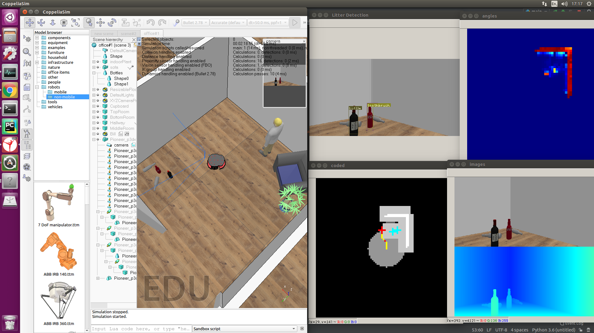

# DijkstraRoomba
This code uses VREP's python API to simulate a robot navigating an office environment.  The workflow is as such;
- Take Depth Map from VREP (VREP.py)
- Calculate XY coordinates (PointCloud.py)
- Calculate angles of point cloud groups (PointCloud.py)
- Plot angles for memory (Mapping.py)
- Find closest unsearched area (closest is judged by cost value) (Navigation.py)
- Send desired wheel speeds back to (VREP.py)

This code uses multiprocessing to share cpu load.  The current setup passses on values serially so it is not completely utlising the cpu's potential; however, this can be changed.  Loop heavy operations are coded in Cython to avoid slow dynamic typing operations in "Gridmean.pyx".  Lastly, extra stuff with object detection (YOLO.py) is currently being tested for later work.

Right is VREP/Coppeliasim. left (top left) RGB image with YOLO image detection. left (top right) birds-eye view, heat map of angles with steep angles (wall) being red. Left(bottom left) birds eye view (see key for colour significance).  Left (bottom right) RGB and Depth image stacked vertically.

Key:
 - White: Wall
 - Gray: Either close to wall or explored
 - Red: Destination
 - Turqoise: Detected Objects
 - Yellow: Path to destination
